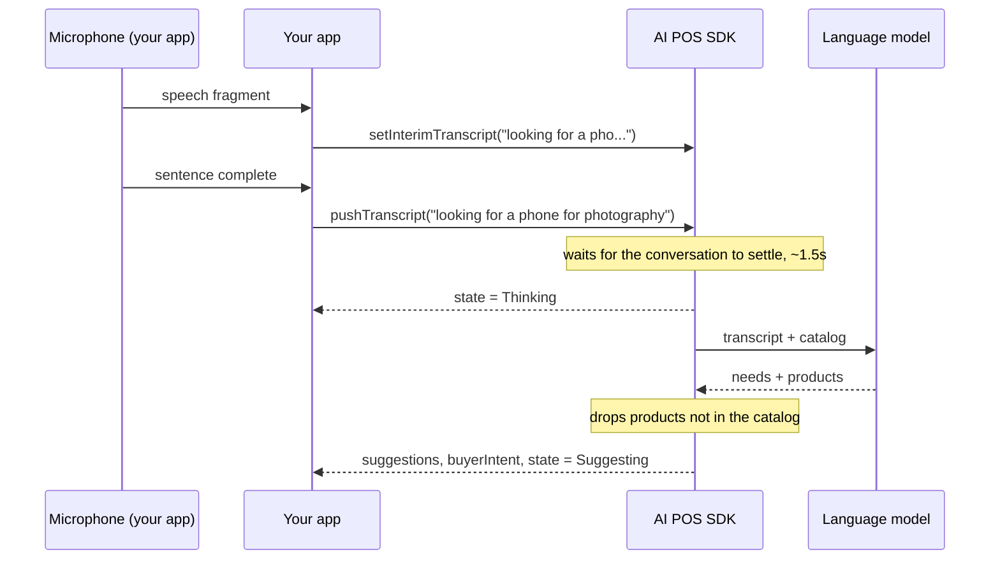

# Product suggestions

Product suggestions listen to the conversation between a salesperson and a customer,
then propose items from your catalog along with the reasoning. The SDK doesn't speak,
doesn't touch the microphone, and doesn't render anything — your app decides how to
present the suggestions.

```
Customer: "saya cari hp buat foto-foto, budget 15 juta"
          (looking for a phone for photography, budget 15 million)
  → iPhone 15 128GB — 48MP camera, still under budget
  → Google Pixel 8  — best low-light photos in its class
```

The SDK's suggestion reasoning comes back in Indonesian, matching its primary market.

**Available on:** `AIPosSDK` (artifact `aipos-sdk`) and `AdvisorClient` (artifact `aipos-advisor`).

## The flow



## Assembling it

**Suggestions only (AdvisorClient)**

```kotlin
val advisor = AdvisorClient.Builder()
    .llmApiKey(BuildConfig.LLM_API_KEY)   // or .llmProxyBaseUrl(...)
    .productCatalog(catalog)
    .build()                              // no Context needed
```

**Alongside other features (AIPosSDK)**

```kotlin
val sdk = AIPosSDK.Builder()
    .llmApiKey(BuildConfig.LLM_API_KEY)
    .merchantInfo(merchant)
    .productCatalog(catalog)
    .android(context)
    .build()
```

`AdvisorClient.Builder` doesn't need a `Context`, so it can be assembled in
`commonMain` of a Kotlin Multiplatform project.

## Feeding in the conversation

```kotlin
// A sentence that is already final
sdk.pushTranscript("looking for a phone for photography, budget 15 million")

// Optional: a partial phrase still being recognized, for ghost text on screen
sdk.setInterimTranscript("looking for a pho...")
```

`pushTranscript` is safe to call as often as you like. Analysis doesn't run per
sentence — it runs after the conversation settles for about 1.5 seconds. To force
analysis immediately — for example when a salesperson taps a "Suggest" button —
call:

```kotlin
sdk.requestSuggestions()
```

The text source is up to you: on-device speech-to-text, a transcription service,
or typing. See [Speech-to-text](https://dev-mobile-wknd.github.io/aipos-sdk-docs/guides/speech-to-text) for Android and iOS
examples.

## Receiving suggestions

```kotlin
sdk.observeSuggestions().collect { suggestions ->
    suggestions.forEach { s ->
        showChip(
            name = s.product.name,
            price = s.product.price.format(),
            reason = s.reason,           // In Indonesian, ready to read aloud to the customer
            confidence = s.confidence,   // 0.0 – 1.0
        )
    }
}
```

Suggestions are sorted from most relevant. Each `ProductSuggestion` carries the full
`Product` object, so you can draw a card and add it to the cart directly:

```kotlin
onChipClick = { s -> scope.launch { sdk.addToCart(s.product.id) } }
```

## Other observable state

| Function | Type | Purpose |
|---|---|---|
| `observeAdvisorState()` | `Flow<AdvisorState>` | `Idle`, `Thinking`, `Suggesting` — for an indicator on the microphone button |
| `observeBuyerIntent()` | `Flow<String>` | A one-sentence summary of the customer's needs |
| `observeTranscript()` | `Flow<List<String>>` | Every sentence submitted so far |
| `observeInterimTranscript()` | `Flow<String>` | The last partial sentence |
| `observeAdvisorError()` | `Flow<String?>` | The latest failure, `null` if none |

`AdvisorState` is kept separate from the suggestion list because the UI needs to
tell *"still thinking"* apart from *"found nothing"* — both mean an empty
suggestion list.

## Compose example

```kotlin
@Composable
fun SuggestionsBar(vm: PosViewModel) {
    val suggestions by vm.suggestions.collectAsStateWithLifecycle()
    val state by vm.advisorState.collectAsStateWithLifecycle()
    val error by vm.advisorError.collectAsStateWithLifecycle()

    Column {
        if (state is AdvisorState.Thinking) {
            LinearProgressIndicator(Modifier.fillMaxWidth())
        }
        error?.let { Text(it, color = MaterialTheme.colorScheme.error) }

        suggestions.forEach { s ->
            AssistChip(
                onClick = { vm.addProduct(s.product) },
                label = { Text("${s.product.name} · ${s.product.price.format()}") },
            )
            Text(s.reason, style = MaterialTheme.typography.bodySmall)
        }
    }
}
```

## Ending a conversation

| Function | Effect |
|---|---|
| `clearAdvisor()` (`AIPosSDK`) / `clear()` (`AdvisorClient`) | Clear the transcript and suggestions; the cart isn't touched |
| `resetSession()` (`AIPosSDK`) | Clear the transcript, suggestions, agent conversation, **and** cart |
| `close()` | Release all resources once suggestions are no longer needed |

Call one of these every time the customer changes. A leftover transcript from the
previous customer would make suggestions target someone who already left.

## Guarantees and limitations

- **Suggestions always come from your catalog.** Products the model mentions but
  that aren't in the catalog are dropped before reaching your app.
- **Requires internet** and a valid language-model key.
- **Privacy:** the conversation transcript and catalog data are sent to the
  language-model provider (or your proxy). Disclose this to customers per your
  store's privacy policy.
