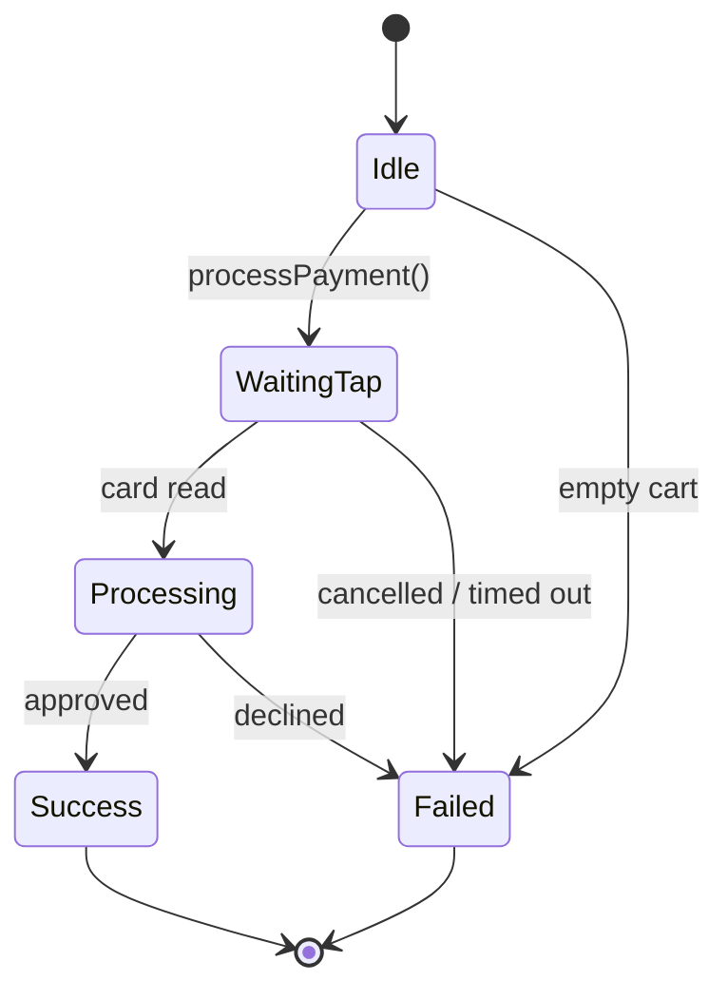

# Card payment

Card payment turns an NFC-equipped Android phone into a *tap-to-pay* terminal via
the MineSec Headless SDK. The customer taps their card or phone, and the SDK
reports every stage until the transaction finishes.

**Available on:** `AIPosSDK` (`aipos-sdk`) and `PaymentClient` (`aipos-payment`). **Android only.**

## Before you start

- [ ] MineSec repository and credentials registered — [Installation](https://dev-mobile-wknd.github.io/aipos-sdk-docs/guide/installation#minesec-repository-card-payment)
- [ ] `AiPosAndroid.initPlatform(...)` called in `Application.onCreate` — [Android](https://dev-mobile-wknd.github.io/aipos-sdk-docs/platform/android#1-initplatform-in-applicationoncreate)
- [ ] `AiPosAndroid.attachActivity(this)` called in the Activity's `onCreate` — [Android](https://dev-mobile-wknd.github.io/aipos-sdk-docs/platform/android#2-attachactivity-in-oncreate)
- [ ] A license file exists in `src/main/assets/` and `MerchantInfo.profileId` is set

## Processing a payment

`processPayment()` charges **the current cart total** and returns a status stream
until the transaction ends:

```kotlin
scope.launch {
    sdk.processPayment().collect { state ->
        when (state) {
            PaymentState.Idle -> Unit
            is PaymentState.WaitingTap -> show("${state.message} (${state.timeoutSeconds}s)")
            is PaymentState.Processing -> show(state.message)
            is PaymentState.Success -> showReceipt(state)
            is PaymentState.Failed -> when {
                state.isCancelled -> show("Payment cancelled")
                state.isTimeout -> show("Timed out, please tap the card again")
                else -> show("Failed: ${state.errorMessage}")
            }
        }
    }
}
```



## Payment status

| State | Field | Meaning |
|---|---|---|
| `Idle` | — | No payment in progress |
| `WaitingTap` | `message`, `timeoutSeconds` | Terminal ready, waiting for a card tap |
| `Processing` | `message`, `cardScheme` | Card read, being processed by the acquirer |
| `Success` | `transactionId`, `amount`, `paymentMethod`, `cardScheme`, `rrn`, `approvalCode`, `posReference` | Approved |
| `Failed` | `errorMessage`, `responseCode`, `isCancelled`, `isTimeout` | Failed, declined, cancelled, or timed out |

`state.isTerminal` is `true` for `Success` and `Failed` — a sign the tap dialog can
be closed.

:::tip[One stream, many observers]
Every status from `processPayment()` is also forwarded to `observePaymentState()`.
Other parts of the UI — like a banner elsewhere on screen — can just observe
`observePaymentState()` without also calling `processPayment()`.
:::

## After a successful payment

The SDK automatically:

1. Saves the `Transaction` to local history.
2. Clears the cart.

What's still your job: **reducing stock** in your own system and recording the
sale to your backend. See [Product catalog](https://dev-mobile-wknd.github.io/aipos-sdk-docs/features/catalog#stock-stays-your-responsibility).

## Cancelling

```kotlin
scope.launch { sdk.cancelPayment() }
```

Stops a payment that's waiting for a tap and returns `observePaymentState()` to
`Idle`. The cart isn't cleared.

## Transaction history

```kotlin
sdk.observeTransactions(limit = 20).collect { transactions ->
    transactions.forEach { t ->
        println("${t.id} · ${t.amount.format()} · ${t.paymentMethod.displayName} · ${t.status}")
    }
}
```

| `Transaction` field | Description |
|---|---|
| `id` | Transaction id from the gateway |
| `cart` | A copy of the cart contents at the time of the transaction |
| `amount` | The amount processed |
| `paymentMethod` | E.g. `Contactless(scheme = VISA, maskedPan = "**** 4242")` |
| `status` | `APPROVED`, `DECLINED`, `CANCELLED`, `TIMEOUT`, or `PENDING` |
| `timestamp` | Epoch milliseconds |
| `rrn` | Retrieval Reference Number, for reconciliation with the acquirer |
| `approvalCode` | Approval code from the card issuer |
| `posReference` | POS-generated order reference |

History is stored on the device. Send transactions to your own backend if you
need to report or reconcile them.

## Simulator

If the artifact you use was built without MineSec, the SDK uses a simulator:

- `WaitingTap` for 2 seconds, then `Processing` for roughly 1.2 seconds, then
  **always** `Success`.
- Messages start with `[SIMULATED]`, `transactionId` starts with `SIM-`, a random
  card scheme (VISA, Mastercard, JCB), and card number `**** 4242`.
- `initPlatform` always succeeds, noting that the simulator is in use.

:::danger[The simulator never moves real money]
Make sure the build that reaches a real cashier uses a real terminal. See
[Android — Real terminal vs. simulator](https://dev-mobile-wknd.github.io/aipos-sdk-docs/platform/android#real-terminal-vs-simulator).
:::

## Validation before charging

`processPayment()` immediately emits `Failed` without touching the terminal when:

| Message | Cause |
|---|---|
| `Keranjang masih kosong` (cart is still empty) | No items yet |
| `Total belanja harus lebih dari Rp 0` (the purchase total must be greater than Rp 0) | A discount consumed the entire total |
