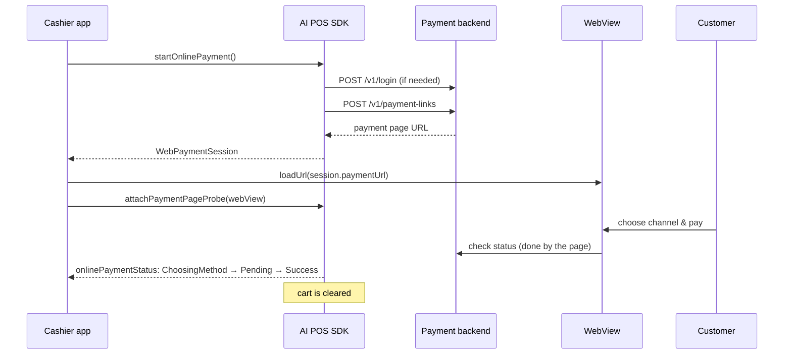

# Online payment

Online payment charges the cart contents through a **payment page** opened in a
WebView. The customer picks their own channel — Virtual Account, QRIS, or card —
and the SDK follows the status until it's paid. The cashier screen only needs to
provide **one** "Pay online" button.

**Available on:** `AIPosSDK` (`aipos-sdk`). Works on Android and iOS.

:::info[About `OnlinePaymentClient`]
The `aipos-payment-online` artifact provides `OnlinePaymentClient` with the same
flow, but as of version 0.1.0 it doesn't yet have a way to fill the cart. The
examples on this page use `AIPosSDK`. The equivalent function names are in the
[OnlinePaymentClient reference](https://dev-mobile-wknd.github.io/aipos-sdk-docs/reference/online-payment-client).
:::

## The flow



## 1. Configuration

```kotlin
val sdk = AIPosSDK.Builder()
    .llmApiKey(BuildConfig.LLM_API_KEY)
    .merchantInfo(merchant)
    .productCatalog(catalog)
    .onlinePayment(
        OnlinePaymentConfig(
            baseUrl = "https://pay-api.tokoanda.co.id",
            apiKey = BuildConfig.POS_BACKEND_API_KEY,
            email = "cashier@tokoanda.co.id",
            password = password,
            loopbackUrlReplacement = "",
        )
    )
    .android(context)
    .build()
```

To build the UI without a backend, use prototype mode: `OnlinePaymentConfig(baseUrl = "")`.
Every configuration option is in [OnlinePaymentConfig](https://dev-mobile-wknd.github.io/aipos-sdk-docs/reference/online-payment-config).

### Authentication

The SDK manages its own token:

1. Exchanges `email` + `password` for a token via `POST {baseUrl}/v1/login`. The
   token is kept **in memory only**.
2. Every `POST /v1/payment-links` carries `X-API-Key: <apiKey>` (identifying the
   device) and `Authorization: Bearer <token>` (identifying the session).
3. If the token is rejected (401/403), the SDK logs in again and retries the
   request once — without involving the cashier.

## 2. Open a payment session

```kotlin
scope.launch {
    when (val result = sdk.startOnlinePayment(note = "Table 4")) {
        is PosResult.Success -> openPaymentPage(result.data)
        is PosResult.Failure -> showMessage(result.message)
    }
}
```

`WebPaymentSession` contains:

| Field | Description |
|---|---|
| `paymentUrl` | The address loaded in the WebView |
| `amount` | The amount being charged, to show on the cashier screen |
| `orderId` | POS-generated order reference |
| `sessionId` | The session's identity on the provider's side |
| `expiresAtMillis` | The session's deadline, `null` if not provided by the provider |

The cart is **not yet** cleared at this stage.

## 3. Show the payment page

**Android (Compose)**

```kotlin
@Composable
fun PaymentPage(sdk: AIPosSDK, session: WebPaymentSession) {
    val context = LocalContext.current

    // Create the WebView ONCE. Recreating it on every recomposition reloads the page
    // and throws the customer back to the start.
    val webView = remember(session.paymentUrl) {
        AiposPaymentWebView(context).apply {
            webViewClient = AiposPaymentWebViewClient(sdk)
            loadUrl(session.paymentUrl)
        }
    }

    // REQUIRED: without the probe, the status gets stuck at ChoosingMethod.
    LaunchedEffect(webView) { sdk.attachPaymentPageProbe(webView.paymentPageProbe()) }

    DisposableEffect(webView) { onDispose { webView.destroy() } }

    AndroidView(factory = { webView }, modifier = Modifier.fillMaxSize())
}
```

**Android (View)**

```kotlin
val webView = AiposPaymentWebView(context)
webView.webViewClient = AiposPaymentWebViewClient(sdk)
webView.loadUrl(session.paymentUrl)

// REQUIRED: without the probe, the status gets stuck at ChoosingMethod.
sdk.attachPaymentPageProbe(webView.paymentPageProbe())
```

**iOS (Swift)**

```swift
webView.navigationDelegate = self   // your own WKNavigationDelegate
urlObservation = webView.observe(\.url) { [weak self] view, _ in
    if let url = view.url?.absoluteString { self?.sdk.onWebViewUrlChanged(url: url) }
}

// REQUIRED: without the probe, the status gets stuck at ChoosingMethod.
sdk.attachPaymentPageProbe(probe: IosPaymentPageProbeKt.paymentPageProbe(webView))

webView.load(URLRequest(url: URL(string: session.paymentUrl)!))
```

A complete `WKNavigationDelegate` example is in [iOS integration](https://dev-mobile-wknd.github.io/aipos-sdk-docs/platform/ios#online-payment-in-wkwebview).

### Why `attachPaymentPageProbe` is required

The payment page moves from choosing-a-method → waiting → paid **without changing
its address**. Watching WebView navigation alone never sees that transition. The
*page probe* reads the status the page itself fetches from its server, roughly
once a second. Call it after the WebView is created, and call it again if the
WebView is recreated.

### Why `AiposPaymentWebView`

- JavaScript and DOM storage are already turned on — the payment page doesn't
  render without them.
- The page is scaled to fit the screen width, with no horizontal scrolling.
- Scrolling stays with the page even when the WebView is inside a
  `ModalBottomSheet`. Without this, scrolling reads as dragging the sheet, and the
  customer never reaches the pay button.

As a consequence, swiping down over the payment page doesn't close the sheet.
Provide a close button outside the WebView area.

If you must use a plain `WebView` (full-screen, not a sheet), call
`webView.prepareForAiposPayment()` before loading the URL.

## 4. Follow the status

```kotlin
sdk.onlinePaymentStatus.collect { status ->
    when (status) {
        WebPaymentStatus.Idle -> Unit
        WebPaymentStatus.ChoosingMethod -> showHint("Customer is choosing a method…")
        is WebPaymentStatus.Pending -> showHint("Waiting for payment…")
        is WebPaymentStatus.Success -> onDone(status.transactionId)
        is WebPaymentStatus.Failed -> onFailed(status.rawStatus)
        is WebPaymentStatus.Cancelled -> closePage()
        is WebPaymentStatus.Unknown -> log("Unrecognized status: ${status.rawStatus}")
    }
}
```

`onlinePaymentStatus` is a `StateFlow` — it always has a value, so the screen can
draw immediately.

| Status | Meaning | `isFinal` |
|---|---|:---:|
| `Idle` | No session running | |
| `ChoosingMethod` | Page open, channel not yet chosen | |
| `Pending(transactionId)` | Channel chosen, waiting for funds | |
| `Success(transactionId)` | The page reports funds received. The cart is cleared automatically. | ✅ |
| `Failed(transactionId, rawStatus)` | Declined, failed, or expired | ✅ |
| `Cancelled(transactionId)` | The cashier closed the page or the provider cancelled it | ✅ |
| `Unknown(transactionId, rawStatus)` | A status code the SDK doesn't recognize. **Never** treated as paid. | |

Once the status is `isFinal`, the WebView may be closed.

### Without `Flow`

For Java, Swift, or a Native Module:

```kotlin
val registration = sdk.addOnlinePaymentListener { status -> render(status) }
// when the screen is closed — required, so the old listener doesn't react to the next transaction
registration.cancel()
```

## 5. Closing or cancelling

| Function | When | Effect on the cart |
|---|---|---|
| `cancelOnlinePayment()` | The cashier closes the page before paying | Not cleared |
| `resetSession()` | Starting a new transaction | Cleared |

## Verifying payment on the backend

:::danger[Don't hand over goods based on `Success` alone]
`WebPaymentStatus.Success` is read from a page running on the cashier's device.
Anyone who controls that device could theoretically fake it. Before handing over
goods or marking an order as paid in your system, **confirm the transaction status
with your own backend**, which receives a direct callback from the payment
provider.
:::

## Configuring the payment page

```kotlin
OnlinePaymentConfig(
    // ...
    allowedPaymentMethods = setOf(OnlinePaymentChannel.VIRTUAL_ACCOUNT, OnlinePaymentChannel.QRIS),
    appearance = PaymentLinkAppearance(
        logoUrl = "https://tokoanda.co.id/logo.png",
        backgroundColor = "#0f766e",
        buttonColor = "#134e4a",
        textMode = PaymentLinkTextMode.LIGHT,
    ),
    customerData = CustomerDataPolicy(
        email = CollectCustomerField(enabled = true, required = false),
    ),
    adminFee = Money.fromRupiah(2_500),
    linkExpiry = 2.hours,
)
```

| Setting | Default |
|---|---|
| `allowedPaymentMethods` | VA, QRIS, and card. Channels are shown in set order. |
| `appearance` | The provider's default look |
| `customerData` | Doesn't request any customer data |
| `adminFee` | No admin fee |
| `linkExpiry` | 24 hours |
| `hiddenButtonLabels` | Hides the "Back to merchant" / "Kembali ke merchant" button on the success page, so the customer doesn't leave before seeing proof of payment |

:::tip[Cards cost more]
Card transaction fees are generally well above VA and QRIS. If your store doesn't
want to absorb that cost, remove `OnlinePaymentChannel.CARD` from
`allowedPaymentMethods`.
:::

## When a provider changes its status codes

The SDK recognizes provider status codes through `PaymentStatusJsonMapping`. Its
defaults:

| Code | Status |
|---|---|
| `active` | `ChoosingMethod` |
| `PNDNG`, `pending` | `Pending` |
| `SETLD`, `settled`, `success`, `paid` | `Success` |
| `FAILD`, `EXPRD`, `RJCTD`, `DECLN`, `failed`, `expired`, … | `Failed` |
| `CNCLD`, `cancelled`, `canceled` | `Cancelled` |

An unrecognized code falls back to `Unknown(rawStatus = ...)` and is logged.
Register a new code without waiting for an SDK release:

```kotlin
OnlinePaymentConfig(
    // ...
    statusJsonMapping = PaymentStatusJsonMapping(
        failedValues = PaymentStatusJsonMapping.DEFAULT_FAILED_VALUES + "VOIDD",
    ),
)
```

## Handling `startOnlinePayment` failures

`PosResult.Failure.message` is safe to show to the cashier. To decide whether a
retry makes sense, check the code:

```kotlin
val result = sdk.startOnlinePayment()
if (result is PosResult.Failure) {
    when (result.onlineErrorCode) {
        OnlinePaymentErrorCode.NETWORK -> showRetryButton()
        OnlinePaymentErrorCode.UNAUTHORIZED -> show("Device not configured. Contact admin.")
        else -> show(result.message)
    }
}
```

The full code list is in [Results & errors](https://dev-mobile-wknd.github.io/aipos-sdk-docs/reference/results-and-errors#onlinepaymenterrorcode).

## Development modes

| Mode | Configuration | Behavior |
|---|---|---|
| Prototype | `baseUrl = ""` | No HTTP requests. A sample payment page. |
| Beta | `OnlinePaymentConfig(apiKey = ...)` | Shared beta backend. |

Whenever `baseUrl` is set — in beta or production mode — SDK version 0.1.0
sends a **simulated settlement** request to `POST {baseUrl}/v1/transactions/simulate-paid`
about three seconds after the `Pending` status, so test flows can reach a paid
state without real money. In prototype mode, no request is sent. See
[Production checklist](https://dev-mobile-wknd.github.io/aipos-sdk-docs/guides/production-checklist#online-payment) for the
implications in production.
