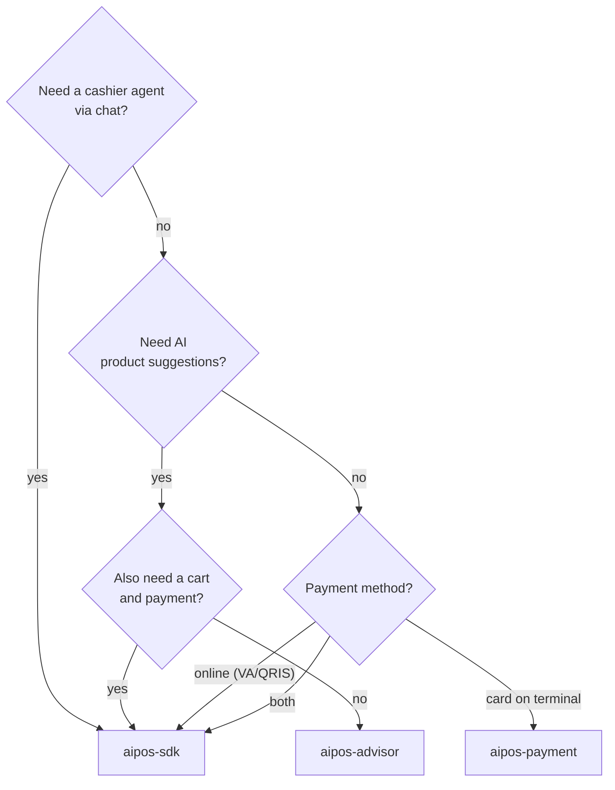
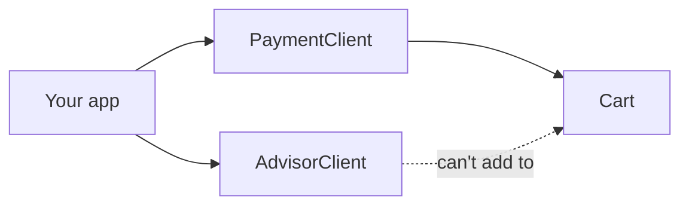

# Choosing an artifact

The SDK is split by feature. Each artifact brings its own dependencies and permissions,
so only add what your app actually uses.

All artifacts use the group `com.weekendinc.aipos` and are released at **the same
version** (`0.1.0`). Don't mix versions across artifacts.

## Artifact list

| Artifact | Contents | Entry point |
|---|---|---|
| `aipos-sdk` | All features in one package | [`AIPosSDK`](https://dev-mobile-wknd.github.io/aipos-sdk-docs/reference/aipos-sdk) |
| `aipos-advisor` | Product suggestions from conversations | [`AdvisorClient`](https://dev-mobile-wknd.github.io/aipos-sdk-docs/reference/advisor-client) |
| `aipos-payment` | Cart + card payment on the terminal | [`PaymentClient`](https://dev-mobile-wknd.github.io/aipos-sdk-docs/reference/payment-client) |
| `aipos-payment-online` | Online payment in a WebView | [`OnlinePaymentClient`](https://dev-mobile-wknd.github.io/aipos-sdk-docs/reference/online-payment-client) ⚠️ |
| `aipos-agent` | Cashier agent | — (used via `aipos-sdk`) |
| `aipos-llm` | Language model client | — (pulled in automatically) |
| `aipos-core` | Data model, catalog, cart | — (pulled in automatically) |

You only need to declare one artifact. The artifacts underneath it are pulled in
transitively, and their types are directly usable from your code.

:::warning[⚠️ `aipos-payment-online` alone can't bill yet]
As of version 0.1.0, `OnlinePaymentClient` charges the cart contents but doesn't yet
provide a way to fill it. To accept online payments, use `aipos-sdk` — the cart and
`startOnlinePayment()` are available on `AIPosSDK`.
:::

## How to choose

## What's carried and what isn't

| Artifact | Carried along | Not carried along |
|---|---|---|
| `aipos-advisor` | OpenAI client, `INTERNET` permission | MineSec, NFC permission, agent |
| `aipos-payment` | MineSec Headless, `NFC` permission, card-tap Activity | OpenAI client, `INTERNET` permission |
| `aipos-payment-online` | Ktor HTTP client | MineSec, NFC permission, OpenAI client, `INTERNET` permission* |
| `aipos-sdk` | Everything above | — |

\* `aipos-payment-online` needs internet but doesn't declare its own permission for it.
Add `android.permission.INTERNET` to your app's manifest if you only use this artifact.

## Using two artifacts side by side

Installing `aipos-advisor` **and** `aipos-payment` together is valid — `aipos-core`
isn't duplicated. However, each entry point has its own cart:

`AdvisorClient` doesn't have a cart at all. If a suggested product needs to go
straight into the cart being paid for, you have two choices:

- Use `aipos-sdk` — one cart is shared by the advisor, agent, and payment.
- Keep using two artifacts, and call `payment.addToCart(suggestion.product.id)`
  yourself when the salesperson taps a suggestion card.

:::tip[Recommendation]
When in doubt, start with `aipos-sdk`. Once the features you use are clear, you can
switch to a smaller artifact without changing your data model.
:::
