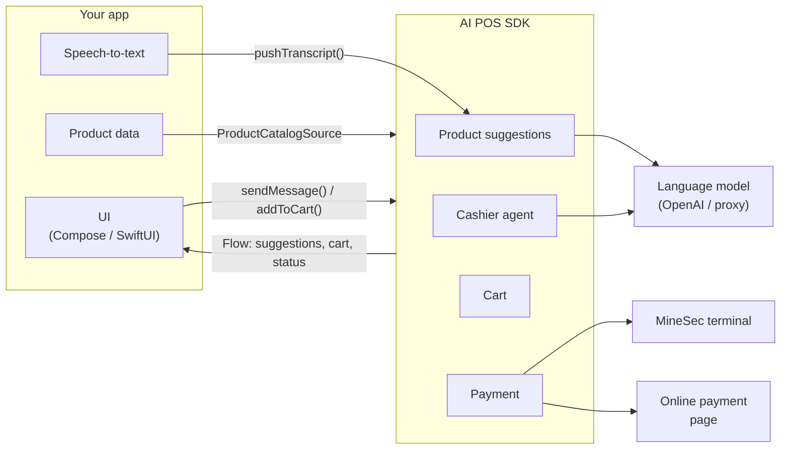

# Introduction

AI POS SDK is a Kotlin Multiplatform library that adds smart-cashier capabilities to
your point-of-sale application. The SDK **does not ship any UI** — every screen, button,
and design stays yours. The SDK provides the logic, data, and transaction flow.

## What it can do

| Capability | Example | Page |
|---|---|---|
| **Product suggestions** | The customer says *"I'm looking for a phone for photography, budget 15 million"* → the SDK suggests the iPhone 15 and Pixel 8 along with the reasons | [Product suggestions](https://dev-mobile-wknd.github.io/aipos-sdk-docs/features/advisor) |
| **Cashier agent** | The cashier types *"find MacBook Air, add 1, pay"* → the agent handles all of it | [Cashier agent](https://dev-mobile-wknd.github.io/aipos-sdk-docs/features/agent) |
| **Cart** | Add, update quantity, remove, with stock validation | [Cart](https://dev-mobile-wknd.github.io/aipos-sdk-docs/features/cart) |
| **Card payment** | The customer taps a card on the Android phone | [Card payment](https://dev-mobile-wknd.github.io/aipos-sdk-docs/features/card-payment) |
| **Online payment** | The customer pays via VA, QRIS, or card on a payment page | [Online payment](https://dev-mobile-wknd.github.io/aipos-sdk-docs/features/online-payment) |

## How it works

Three principles worth understanding from the start:

1. **Product data is yours.** The SDK doesn't have a catalog of its own. You hand over
   your product list through [`ProductCatalogSource`](https://dev-mobile-wknd.github.io/aipos-sdk-docs/features/catalog), and the SDK
   only reads it.
2. **The microphone is yours.** For product suggestions, your app records audio and
   converts it to text, then feeds the text to the SDK.
   See [Speech-to-text](https://dev-mobile-wknd.github.io/aipos-sdk-docs/guides/speech-to-text).
3. **All state is a stream.** Cart, suggestions, and payment status are emitted as
   Kotlin `Flow`s, so your screen just observes and redraws.

## Platform support

| Feature | Android | iOS |
|---|:---:|:---:|
| Product suggestions | ✅ | ✅ |
| Cashier agent | ✅ | ✅ |
| Cart & transaction history | ✅ | ✅ |
| Contactless card payment | ✅ | ❌ |
| Online payment (WebView) | ✅ | ✅ |

:::info[Why iOS can't accept cards yet]
CoreNFC on iPhone can only read tags, not act as an EMV terminal. Tap to Pay on
iPhone requires the `ProximityReader` framework along with a special entitlement
from Apple. On iOS, `processPayment()` immediately emits `PaymentState.Failed` with
that explanation. Use [online payment](https://dev-mobile-wknd.github.io/aipos-sdk-docs/features/online-payment) instead.
:::

## Requirements

| Requirement | Version |
|---|---|
| Android `minSdk` | 26 (Android 8.0) |
| Android `compileSdk` | 36 |
| JDK for building | 17 |
| Kotlin (Kotlin Multiplatform project) | 2.3.21 or newer |
| iOS | Targets `iosArm64`, `iosSimulatorArm64`, `iosX64` |
| Language model key | OpenAI API key or an OpenAI-compatible proxy endpoint — only for AI features |
| MineSec credentials | Only for real card payments |

## Next steps

- [Choosing artifacts](https://dev-mobile-wknd.github.io/aipos-sdk-docs/guide/choosing-artifacts) — determine which modules you need.
- [Installation](https://dev-mobile-wknd.github.io/aipos-sdk-docs/guide/installation) — add the SDK to your Gradle project.
- [Quick start](https://dev-mobile-wknd.github.io/aipos-sdk-docs/guide/quick-start) — your first transaction in ten minutes, no hardware required.
