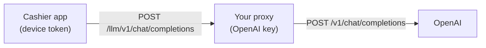

# LLM proxy

An API key bundled into an app can be extracted from the APK or IPA. For
production, store the key on your server and have the app call that server
instead.



## Configuring the app

```kotlin
AIPosSDK.Builder()
    .llmProxyBaseUrl("https://api.tokoanda.com/llm")   // without /v1
    .llmApiKey(deviceToken)                             // optional: sent to the proxy, not to OpenAI
    // ...
```

If `llmProxyBaseUrl` is set, the SDK calls `{llmProxyBaseUrl}/v1/chat/completions`.
`llmApiKey` — if present — is sent as an `Authorization: Bearer` token to the
proxy, so the proxy can identify and revoke a specific device.

## Proxy requirements

The proxy must be **compatible with the OpenAI Chat Completions API**:

- Accept `POST /v1/chat/completions` with an OpenAI-format request body.
- Support *tool* calls (function calling) — used by the cashier agent.
- Return responses in OpenAI format.
- Serve the model the SDK requests: **GPT-5.4 mini** (`OpenAIModels.Chat.GPT5_4Mini`).
  If your proxy maps to a different model, make sure that model also supports
  *tools*.

Options that already satisfy this:

| Option | Notes |
|---|---|
| **LiteLLM** | A ready-made gateway; supports per-key quotas and multiple providers |
| **Azure OpenAI** | Point at its OpenAI-compatible endpoint |
| **Your own backend** | Forward the request as-is to OpenAI while attaching the key |

## Minimal proxy example (Node.js)

```javascript
import express from 'express';

const app = express();
app.use(express.json({ limit: '2mb' }));

app.post('/llm/v1/chat/completions', async (req, res) => {
  const token = req.get('authorization')?.replace('Bearer ', '');
  if (!(await isDeviceAuthorized(token))) return res.status(401).json({ error: 'unauthorized' });

  const upstream = await fetch('https://api.openai.com/v1/chat/completions', {
    method: 'POST',
    headers: {
      'content-type': 'application/json',
      authorization: `Bearer ${process.env.OPENAI_API_KEY}`,
    },
    body: JSON.stringify(req.body),
  });

  res.status(upstream.status).type('application/json').send(await upstream.text());
});

app.listen(8080);
```

Add to your proxy: a per-device rate limit, usage logging, and an allowed-model
list.

## Common mistakes

| Symptom | Cause |
|---|---|
| 404 from the proxy | `llmProxyBaseUrl` ends with `/v1`, so the path becomes `/v1/v1/chat/completions` |
| Empty suggestions, `observeAdvisorError()` has a 401 message | The proxy rejected the device token |
| The agent never runs an action | The proxy or the model behind it doesn't support *tools* |
