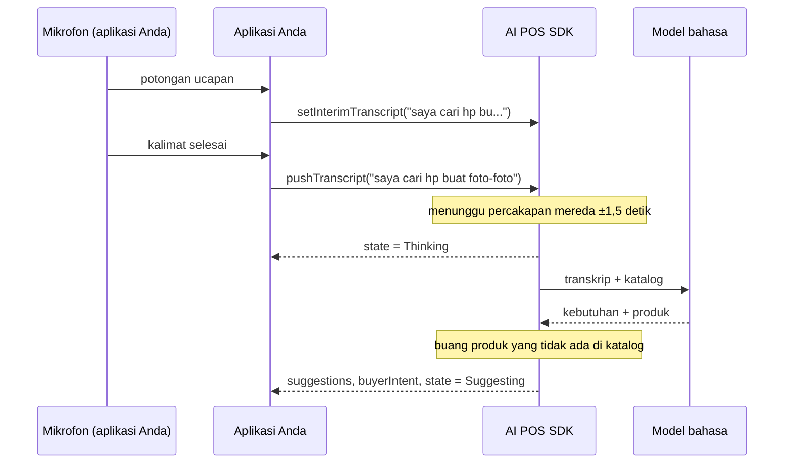

# Penyaran produk

Penyaran produk menyimak percakapan antara sales dan pelanggan, lalu mengusulkan barang dari
katalog Anda beserta alasannya. SDK tidak ikut bicara, tidak menyentuh mikrofon, dan tidak
menampilkan apa pun — aplikasi Anda yang memutuskan cara menyajikan sarannya.

```
Pelanggan : "saya cari hp buat foto-foto, budget 15 juta"
  → iPhone 15 128GB — kamera 48MP, masih di bawah budget
  → Google Pixel 8  — foto malam hari terbaik di kelasnya
```

**Tersedia di:** `AIPosSDK` (artifact `aipos-sdk`) dan `AdvisorClient` (artifact `aipos-advisor`).

## Alurnya



## Merakit

**Hanya penyaran (AdvisorClient)**

```kotlin
val advisor = AdvisorClient.Builder()
    .llmApiKey(BuildConfig.LLM_API_KEY)   // or .llmProxyBaseUrl(...)
    .productCatalog(catalog)
    .build()                              // no Context needed
```

**Bersama fitur lain (AIPosSDK)**

```kotlin
val sdk = AIPosSDK.Builder()
    .llmApiKey(BuildConfig.LLM_API_KEY)
    .merchantInfo(merchant)
    .productCatalog(catalog)
    .android(context)
    .build()
```

`AdvisorClient.Builder` tidak membutuhkan `Context`, sehingga bisa dirakit di `commonMain`
proyek Kotlin Multiplatform.

## Menyetor percakapan

```kotlin
// A sentence that is already final
sdk.pushTranscript("looking for a phone for photography, budget 15 million")

// Optional: a partial phrase still being recognized, for ghost text on screen
sdk.setInterimTranscript("looking for a pho...")
```

`pushTranscript` aman dipanggil sesering apa pun. Analisis tidak dijalankan per kalimat,
melainkan setelah percakapan mereda sekitar 1,5 detik. Untuk memaksa analisis segera —
misalnya saat sales menekan tombol "Saran" — panggil:

```kotlin
sdk.requestSuggestions()
```

Sumber teks bebas: speech-to-text perangkat, layanan transkripsi, atau ketikan. Lihat
[Speech-to-text](https://dev-mobile-wknd.github.io/aipos-sdk-docs/id/guides/speech-to-text) untuk contoh di Android dan iOS.

## Menerima saran

```kotlin
sdk.observeSuggestions().collect { suggestions ->
    suggestions.forEach { s ->
        showChip(
            name = s.product.name,
            price = s.product.price.format(),
            reason = s.reason,           // In Indonesian, ready to read aloud to the customer
            confidence = s.confidence,   // 0.0 – 1.0
        )
    }
}
```

Saran diurutkan dari yang paling relevan. Setiap `ProductSuggestion` membawa objek
`Product` utuh, jadi Anda bisa langsung menggambar kartu dan menambahkannya ke keranjang:

```kotlin
onChipClick = { s -> scope.launch { sdk.addToCart(s.product.id) } }
```

## State lain yang bisa diamati

| Fungsi | Tipe | Kegunaan |
|---|---|---|
| `observeAdvisorState()` | `Flow<AdvisorState>` | `Idle`, `Thinking`, `Suggesting` — untuk indikator di tombol mikrofon |
| `observeBuyerIntent()` | `Flow<String>` | Ringkasan kebutuhan pelanggan dalam satu kalimat |
| `observeTranscript()` | `Flow<List<String>>` | Semua kalimat yang sudah disetor |
| `observeInterimTranscript()` | `Flow<String>` | Potongan kalimat terakhir |
| `observeAdvisorError()` | `Flow<String?>` | Kegagalan terakhir, `null` bila tidak ada |

`AdvisorState` dipisahkan dari daftar saran karena UI perlu membedakan *"sedang berpikir"*
dari *"tidak menemukan apa pun"* — keduanya sama-sama berarti daftar saran kosong.

## Contoh Compose

```kotlin
@Composable
fun SuggestionsBar(vm: PosViewModel) {
    val suggestions by vm.suggestions.collectAsStateWithLifecycle()
    val state by vm.advisorState.collectAsStateWithLifecycle()
    val error by vm.advisorError.collectAsStateWithLifecycle()

    Column {
        if (state is AdvisorState.Thinking) {
            LinearProgressIndicator(Modifier.fillMaxWidth())
        }
        error?.let { Text(it, color = MaterialTheme.colorScheme.error) }

        suggestions.forEach { s ->
            AssistChip(
                onClick = { vm.addProduct(s.product) },
                label = { Text("${s.product.name} · ${s.product.price.format()}") },
            )
            Text(s.reason, style = MaterialTheme.typography.bodySmall)
        }
    }
}
```

## Mengakhiri percakapan

| Fungsi | Efek |
|---|---|
| `clearAdvisor()` (`AIPosSDK`) / `clear()` (`AdvisorClient`) | Kosongkan transkrip dan saran; keranjang tidak disentuh |
| `resetSession()` (`AIPosSDK`) | Kosongkan transkrip, saran, percakapan agent, **dan** keranjang |
| `close()` | Lepaskan semua sumber daya saat penyaran tidak dipakai lagi |

Panggil salah satunya setiap kali pelanggan berganti. Transkrip pelanggan sebelumnya yang
masih tersimpan akan membuat saran mengarah ke orang yang sudah pergi.

## Jaminan dan batasan

- **Saran selalu dari katalog Anda.** Produk yang disebut model tetapi tidak ada di katalog
  dibuang sebelum sampai ke aplikasi.
- **Membutuhkan internet** dan kunci model bahasa yang valid.
- **Privasi:** transkrip percakapan dan data katalog dikirim ke penyedia model bahasa (atau
  proxy Anda). Informasikan hal ini kepada pelanggan sesuai kebijakan privasi toko Anda.
