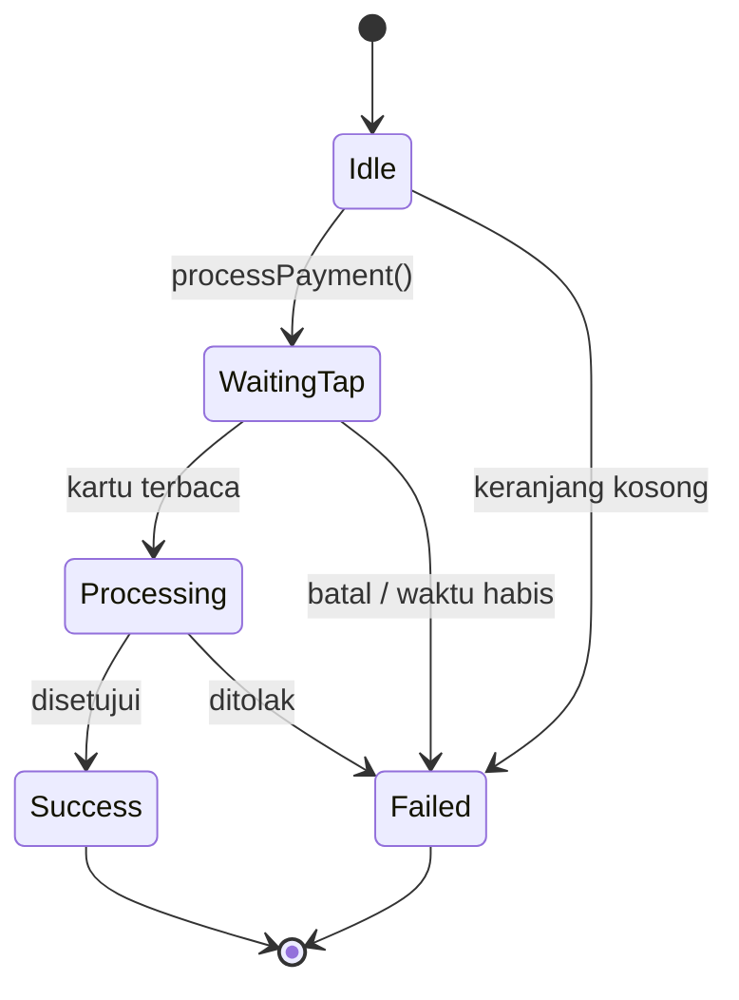

# Pembayaran kartu

Pembayaran kartu mengubah ponsel Android ber-NFC menjadi terminal *tap-to-pay* lewat
MineSec Headless SDK. Pelanggan menempelkan kartu atau ponselnya, dan SDK melaporkan setiap
tahap sampai transaksi selesai.

**Tersedia di:** `AIPosSDK` (`aipos-sdk`) dan `PaymentClient` (`aipos-payment`). **Android saja.**

## Sebelum mulai

- [ ] Repository dan kredensial MineSec terdaftar — [Instalasi](https://dev-mobile-wknd.github.io/aipos-sdk-docs/id/guide/installation#repository-minesec-pembayaran-kartu)
- [ ] `AiPosAndroid.initPlatform(...)` dipanggil di `Application.onCreate` — [Android](https://dev-mobile-wknd.github.io/aipos-sdk-docs/id/platform/android#1-initplatform-di-applicationoncreate)
- [ ] `AiPosAndroid.attachActivity(this)` dipanggil di `onCreate` Activity — [Android](https://dev-mobile-wknd.github.io/aipos-sdk-docs/id/platform/android#2-attachactivity-di-oncreate)
- [ ] File lisensi ada di `src/main/assets/` dan `MerchantInfo.profileId` terisi

## Memproses pembayaran

`processPayment()` menagih **total keranjang saat ini** dan mengembalikan stream status
sampai transaksi berakhir:

```kotlin
scope.launch {
    sdk.processPayment().collect { state ->
        when (state) {
            PaymentState.Idle -> Unit
            is PaymentState.WaitingTap -> show("${state.message} (${state.timeoutSeconds}s)")
            is PaymentState.Processing -> show(state.message)
            is PaymentState.Success -> showReceipt(state)
            is PaymentState.Failed -> when {
                state.isCancelled -> show("Payment cancelled")
                state.isTimeout -> show("Timed out, please tap the card again")
                else -> show("Failed: ${state.errorMessage}")
            }
        }
    }
}
```



## Status pembayaran

| State | Field | Arti |
|---|---|---|
| `Idle` | — | Tidak ada pembayaran berjalan |
| `WaitingTap` | `message`, `timeoutSeconds` | Terminal siap, menunggu kartu ditempelkan |
| `Processing` | `message`, `cardScheme` | Kartu terbaca, sedang diproses ke acquirer |
| `Success` | `transactionId`, `amount`, `paymentMethod`, `cardScheme`, `rrn`, `approvalCode`, `posReference` | Disetujui |
| `Failed` | `errorMessage`, `responseCode`, `isCancelled`, `isTimeout` | Gagal, ditolak, dibatalkan, atau waktu habis |

`state.isTerminal` bernilai `true` untuk `Success` dan `Failed` — tanda dialog tap boleh
ditutup.

:::tip[Satu stream, banyak pengamat]
Setiap status dari `processPayment()` juga diteruskan ke `observePaymentState()`. Bagian
UI lain — misalnya banner di atas layar — cukup mengamati `observePaymentState()` tanpa
ikut memanggil `processPayment()`.
:::

## Setelah pembayaran berhasil

SDK otomatis:

1. Menyimpan `Transaction` ke riwayat lokal.
2. Mengosongkan keranjang.

Yang tetap jadi tugas Anda: **mengurangi stok** di sistem Anda dan mencatat penjualan ke
backend. Lihat [Katalog produk](https://dev-mobile-wknd.github.io/aipos-sdk-docs/id/features/catalog#stok-tetap-tanggung-jawab-anda).

## Membatalkan

```kotlin
scope.launch { sdk.cancelPayment() }
```

Menghentikan pembayaran yang sedang menunggu tap dan mengembalikan
`observePaymentState()` ke `Idle`. Keranjang tidak dikosongkan.

## Riwayat transaksi

```kotlin
sdk.observeTransactions(limit = 20).collect { transactions ->
    transactions.forEach { t ->
        println("${t.id} · ${t.amount.format()} · ${t.paymentMethod.displayName} · ${t.status}")
    }
}
```

| Field `Transaction` | Keterangan |
|---|---|
| `id` | Id transaksi dari gateway |
| `cart` | Salinan isi keranjang saat transaksi terjadi |
| `amount` | Jumlah yang diproses |
| `paymentMethod` | Misalnya `Contactless(scheme = VISA, maskedPan = "**** 4242")` |
| `status` | `APPROVED`, `DECLINED`, `CANCELLED`, `TIMEOUT`, atau `PENDING` |
| `timestamp` | Milidetik epoch |
| `rrn` | Retrieval Reference Number, untuk rekonsiliasi dengan acquirer |
| `approvalCode` | Kode persetujuan dari penerbit kartu |
| `posReference` | Referensi pesanan buatan POS |

Riwayat disimpan di perangkat. Kirim transaksi ke backend Anda sendiri bila perlu
dilaporkan atau direkonsiliasi.

## Simulator

Bila artifact yang Anda pakai dibangun tanpa MineSec, SDK memakai simulator:

- `WaitingTap` selama 2 detik, lalu `Processing` selama ±1,2 detik, lalu **selalu** `Success`.
- Pesan diawali `[SIMULASI]`, `transactionId` diawali `SIM-`, skema kartu acak (VISA,
  Mastercard, JCB), dan nomor kartu `**** 4242`.
- `initPlatform` selalu sukses dengan keterangan bahwa simulator yang dipakai.

:::danger[Simulator tidak memindahkan uang]
Pastikan build yang sampai ke kasir memakai terminal sungguhan. Lihat
[Android — Terminal sungguhan vs simulator](https://dev-mobile-wknd.github.io/aipos-sdk-docs/id/platform/android#terminal-sungguhan-vs-simulator).
:::

## Validasi sebelum menagih

`processPayment()` langsung memancarkan `Failed` tanpa menyentuh terminal bila:

| Pesan | Penyebab |
|---|---|
| `Keranjang masih kosong` | Belum ada barang |
| `Total belanja harus lebih dari Rp 0` | Potongan harga menghabiskan seluruh total |
