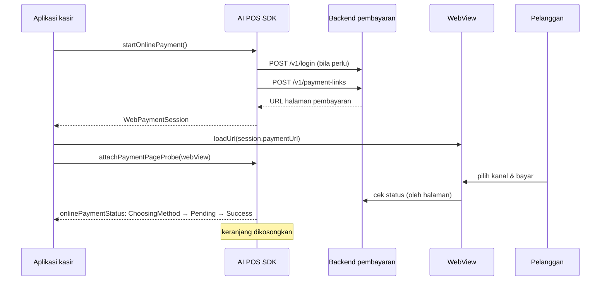

# Pembayaran online

Pembayaran online menagih isi keranjang lewat **halaman pembayaran** yang dibuka di WebView.
Pelanggan memilih sendiri kanalnya — Virtual Account, QRIS, atau kartu — dan SDK mengikuti
statusnya sampai lunas. Layar kasir cukup menyediakan **satu** tombol "Pembayaran Online".

**Tersedia di:** `AIPosSDK` (`aipos-sdk`). Berjalan di Android dan iOS.

:::info[Tentang `OnlinePaymentClient`]
Artifact `aipos-payment-online` menyediakan `OnlinePaymentClient` dengan alur yang sama,
tetapi pada versi 0.1.0 belum punya fungsi untuk mengisi keranjang. Contoh di halaman ini
memakai `AIPosSDK`. Padanan nama fungsinya ada di
[Referensi OnlinePaymentClient](https://dev-mobile-wknd.github.io/aipos-sdk-docs/id/reference/online-payment-client).
:::

## Alurnya



## 1. Konfigurasi

```kotlin
val sdk = AIPosSDK.Builder()
    .llmApiKey(BuildConfig.LLM_API_KEY)
    .merchantInfo(merchant)
    .productCatalog(catalog)
    .onlinePayment(
        OnlinePaymentConfig(
            baseUrl = "https://pay-api.tokoanda.co.id",
            apiKey = BuildConfig.POS_BACKEND_API_KEY,
            email = "cashier@tokoanda.co.id",
            password = password,
            loopbackUrlReplacement = "",
        )
    )
    .android(context)
    .build()
```

Untuk mengembangkan UI tanpa backend, pakai mode purwarupa: `OnlinePaymentConfig(baseUrl = "")`.
Semua pilihan konfigurasi ada di [OnlinePaymentConfig](https://dev-mobile-wknd.github.io/aipos-sdk-docs/id/reference/online-payment-config).

### Autentikasi

SDK mengurus token sendiri:

1. Menukar `email` + `password` jadi token lewat `POST {baseUrl}/v1/login`. Token disimpan
   **di memori saja**.
2. Setiap `POST /v1/payment-links` membawa `X-API-Key: <apiKey>` (menandai perangkat) dan
   `Authorization: Bearer <token>` (menandai sesi).
3. Bila token ditolak (401/403), SDK login ulang dan mengulang permintaan sekali — tanpa
   melibatkan kasir.

## 2. Buka sesi pembayaran

```kotlin
scope.launch {
    when (val result = sdk.startOnlinePayment(note = "Table 4")) {
        is PosResult.Success -> openPaymentPage(result.data)
        is PosResult.Failure -> showMessage(result.message)
    }
}
```

`WebPaymentSession` berisi:

| Field | Keterangan |
|---|---|
| `paymentUrl` | Alamat yang dimuat di WebView |
| `amount` | Jumlah yang ditagihkan, untuk ditampilkan di layar kasir |
| `orderId` | Referensi pesanan buatan POS |
| `sessionId` | Identitas sesi di sisi penyedia |
| `expiresAtMillis` | Batas waktu sesi, `null` bila tidak diberikan penyedia |

Keranjang **belum** dikosongkan di tahap ini.

## 3. Tampilkan halaman pembayaran

**Android (Compose)**

```kotlin
@Composable
fun PaymentPage(sdk: AIPosSDK, session: WebPaymentSession) {
    val context = LocalContext.current

    // Create the WebView ONCE. Recreating it on every recomposition reloads the page
    // and throws the customer back to the start.
    val webView = remember(session.paymentUrl) {
        AiposPaymentWebView(context).apply {
            webViewClient = AiposPaymentWebViewClient(sdk)
            loadUrl(session.paymentUrl)
        }
    }

    // REQUIRED: without the probe, the status gets stuck at ChoosingMethod.
    LaunchedEffect(webView) { sdk.attachPaymentPageProbe(webView.paymentPageProbe()) }

    DisposableEffect(webView) { onDispose { webView.destroy() } }

    AndroidView(factory = { webView }, modifier = Modifier.fillMaxSize())
}
```

**Android (View)**

```kotlin
val webView = AiposPaymentWebView(context)
webView.webViewClient = AiposPaymentWebViewClient(sdk)
webView.loadUrl(session.paymentUrl)

// REQUIRED: without the probe, the status gets stuck at ChoosingMethod.
sdk.attachPaymentPageProbe(webView.paymentPageProbe())
```

**iOS (Swift)**

```swift
webView.navigationDelegate = self   // your own WKNavigationDelegate
urlObservation = webView.observe(\.url) { [weak self] view, _ in
    if let url = view.url?.absoluteString { self?.sdk.onWebViewUrlChanged(url: url) }
}

// REQUIRED: without the probe, the status gets stuck at ChoosingMethod.
sdk.attachPaymentPageProbe(probe: IosPaymentPageProbeKt.paymentPageProbe(webView))

webView.load(URLRequest(url: URL(string: session.paymentUrl)!))
```

Contoh `WKNavigationDelegate` lengkap ada di [Integrasi iOS](https://dev-mobile-wknd.github.io/aipos-sdk-docs/id/platform/ios#pembayaran-online-di-wkwebview).

### Kenapa `attachPaymentPageProbe` wajib

Halaman pembayaran berpindah dari pilih-metode → menunggu → lunas **tanpa mengubah
alamatnya**. Memantau navigasi WebView saja tidak pernah melihat perpindahan itu. *Page
probe* membaca jawaban status yang diambil halaman dari servernya sendiri, sekitar sekali
per detik. Panggil setelah WebView dibuat, dan panggil lagi bila WebView dibuat ulang.

### Kenapa `AiposPaymentWebView`

- JavaScript dan DOM storage sudah menyala — halaman pembayaran tidak tampil tanpa keduanya.
- Halaman diperkecil agar muat selebar layar, tanpa geser kiri-kanan.
- Guliran tetap milik halaman walau WebView ada di dalam `ModalBottomSheet`. Tanpa ini,
  menggulir terbaca sebagai menggeser sheet, dan pelanggan tidak pernah sampai ke tombol bayar.

Konsekuensinya, geser-ke-bawah di atas halaman pembayaran tidak menutup sheet. Sediakan
tombol tutup di luar area WebView.

Bila Anda harus memakai `WebView` biasa (layar penuh, bukan sheet), panggil
`webView.prepareForAiposPayment()` sebelum memuat URL.

## 4. Ikuti statusnya

```kotlin
sdk.onlinePaymentStatus.collect { status ->
    when (status) {
        WebPaymentStatus.Idle -> Unit
        WebPaymentStatus.ChoosingMethod -> showHint("Customer is choosing a method…")
        is WebPaymentStatus.Pending -> showHint("Waiting for payment…")
        is WebPaymentStatus.Success -> onDone(status.transactionId)
        is WebPaymentStatus.Failed -> onFailed(status.rawStatus)
        is WebPaymentStatus.Cancelled -> closePage()
        is WebPaymentStatus.Unknown -> log("Unrecognized status: ${status.rawStatus}")
    }
}
```

`onlinePaymentStatus` adalah `StateFlow` — selalu punya nilai, jadi layar bisa langsung
menggambar.

| Status | Arti | `isFinal` |
|---|---|:---:|
| `Idle` | Tidak ada sesi berjalan | |
| `ChoosingMethod` | Halaman terbuka, kanal belum dipilih | |
| `Pending(transactionId)` | Kanal dipilih, menunggu dana | |
| `Success(transactionId)` | Halaman menyatakan dana diterima. Keranjang dikosongkan otomatis. | ✅ |
| `Failed(transactionId, rawStatus)` | Ditolak, gagal, atau kedaluwarsa | ✅ |
| `Cancelled(transactionId)` | Kasir menutup halaman atau penyedia membatalkan | ✅ |
| `Unknown(transactionId, rawStatus)` | Kode status yang belum dikenal SDK. **Tidak pernah** dianggap lunas. | |

Setelah status `isFinal`, WebView boleh ditutup.

### Tanpa `Flow`

Untuk Java, Swift, atau Native Module:

```kotlin
val registration = sdk.addOnlinePaymentListener { status -> render(status) }
// when the screen is closed — required, so the old listener doesn't react to the next transaction
registration.cancel()
```

## 5. Menutup atau membatalkan

| Fungsi | Kapan | Efek pada keranjang |
|---|---|---|
| `cancelOnlinePayment()` | Kasir menutup halaman sebelum lunas | Tidak dikosongkan |
| `resetSession()` | Mulai transaksi baru | Dikosongkan |

## Verifikasi pembayaran di backend

:::danger[Jangan serahkan barang hanya berdasarkan `Success`]
`WebPaymentStatus.Success` dibaca dari halaman yang berjalan di perangkat kasir. Siapa pun
yang mengendalikan perangkat itu secara teori bisa memalsukannya. Sebelum barang diserahkan
atau pesanan ditandai lunas di sistem Anda, **konfirmasikan status transaksi ke backend
Anda**, yang menerima callback langsung dari penyedia pembayaran.
:::

## Mengatur halaman pembayaran

```kotlin
OnlinePaymentConfig(
    // ...
    allowedPaymentMethods = setOf(OnlinePaymentChannel.VIRTUAL_ACCOUNT, OnlinePaymentChannel.QRIS),
    appearance = PaymentLinkAppearance(
        logoUrl = "https://tokoanda.co.id/logo.png",
        backgroundColor = "#0f766e",
        buttonColor = "#134e4a",
        textMode = PaymentLinkTextMode.LIGHT,
    ),
    customerData = CustomerDataPolicy(
        email = CollectCustomerField(enabled = true, required = false),
    ),
    adminFee = Money.fromRupiah(2_500),
    linkExpiry = 2.hours,
)
```

| Pengaturan | Bawaan |
|---|---|
| `allowedPaymentMethods` | VA, QRIS, dan kartu. Kanal ditampilkan sesuai urutan set. |
| `appearance` | Tampilan bawaan penyedia |
| `customerData` | Tidak meminta data pelanggan apa pun |
| `adminFee` | Tanpa biaya admin |
| `linkExpiry` | 24 jam |
| `hiddenButtonLabels` | Menyembunyikan tombol "Back to merchant" / "Kembali ke merchant" di halaman sukses, supaya pelanggan tidak meninggalkan bukti pembayarannya |

:::tip[Kartu punya biaya lebih tinggi]
Biaya transaksi kartu umumnya jauh di atas VA dan QRIS. Bila toko Anda tidak ingin
menanggungnya, keluarkan `OnlinePaymentChannel.CARD` dari `allowedPaymentMethods`.
:::

## Bila penyedia mengubah kode status

SDK mengenali kode status dari penyedia lewat `PaymentStatusJsonMapping`. Bawaannya:

| Kode | Status |
|---|---|
| `active` | `ChoosingMethod` |
| `PNDNG`, `pending` | `Pending` |
| `SETLD`, `settled`, `success`, `paid` | `Success` |
| `FAILD`, `EXPRD`, `RJCTD`, `DECLN`, `failed`, `expired`, … | `Failed` |
| `CNCLD`, `cancelled`, `canceled` | `Cancelled` |

Kode yang tidak dikenal jatuh ke `Unknown(rawStatus = ...)` dan tercatat di log. Daftarkan
kode barunya tanpa menunggu rilis SDK:

```kotlin
OnlinePaymentConfig(
    // ...
    statusJsonMapping = PaymentStatusJsonMapping(
        failedValues = PaymentStatusJsonMapping.DEFAULT_FAILED_VALUES + "VOIDD",
    ),
)
```

## Menangani kegagalan `startOnlinePayment`

`PosResult.Failure.message` aman ditampilkan ke kasir. Untuk memutuskan boleh tidaknya
mencoba ulang, periksa kodenya:

```kotlin
val result = sdk.startOnlinePayment()
if (result is PosResult.Failure) {
    when (result.onlineErrorCode) {
        OnlinePaymentErrorCode.NETWORK -> showRetryButton()
        OnlinePaymentErrorCode.UNAUTHORIZED -> show("Device not configured. Contact admin.")
        else -> show(result.message)
    }
}
```

Daftar kode lengkap ada di [Hasil & error](https://dev-mobile-wknd.github.io/aipos-sdk-docs/id/reference/results-and-errors#onlinepaymenterrorcode).

## Mode pengembangan

| Mode | Konfigurasi | Perilaku |
|---|---|---|
| Purwarupa | `baseUrl = ""` | Tidak ada permintaan HTTP. Halaman pembayaran contoh. |
| Beta | `OnlinePaymentConfig(apiKey = ...)` | Backend beta bersama. |

Setiap kali `baseUrl` terisi — di mode beta maupun produksi — SDK versi 0.1.0 mengirim
permintaan **pelunasan tiruan** ke `POST {baseUrl}/v1/transactions/simulate-paid` sekitar tiga
detik setelah status `Pending`, supaya alur uji bisa sampai lunas tanpa uang sungguhan. Di mode
purwarupa tidak ada permintaan yang dikirim. Lihat
[Siap produksi](https://dev-mobile-wknd.github.io/aipos-sdk-docs/id/guides/production-checklist#pembayaran-online) untuk dampaknya di produksi.
