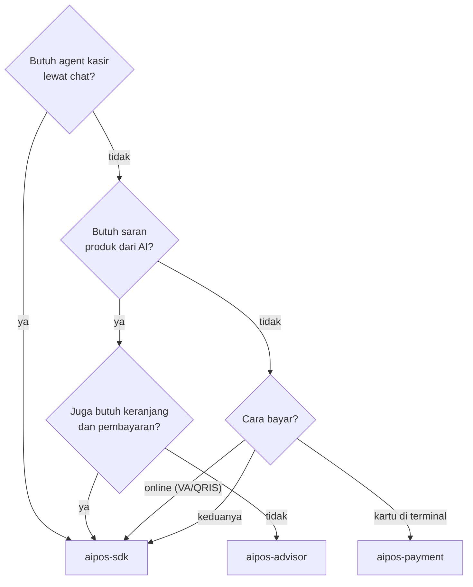
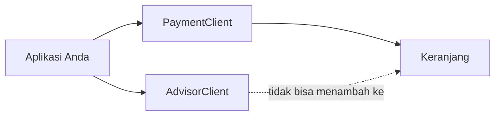

# Memilih artifact

SDK dipecah per fitur. Setiap artifact membawa dependensi dan izin yang berbeda, jadi
pasang hanya yang benar-benar dipakai aplikasi Anda.

Semua artifact memakai group `com.weekendinc.aipos` dan dirilis pada **satu versi yang
sama** (`0.1.0`). Jangan mencampur versi antar-artifact.

## Daftar artifact

| Artifact | Isi | Titik masuk |
|---|---|---|
| `aipos-sdk` | Semua fitur dalam satu paket | [`AIPosSDK`](https://dev-mobile-wknd.github.io/aipos-sdk-docs/id/reference/aipos-sdk) |
| `aipos-advisor` | Penyaran produk dari percakapan | [`AdvisorClient`](https://dev-mobile-wknd.github.io/aipos-sdk-docs/id/reference/advisor-client) |
| `aipos-payment` | Keranjang + pembayaran kartu di terminal | [`PaymentClient`](https://dev-mobile-wknd.github.io/aipos-sdk-docs/id/reference/payment-client) |
| `aipos-payment-online` | Pembayaran online di WebView | [`OnlinePaymentClient`](https://dev-mobile-wknd.github.io/aipos-sdk-docs/id/reference/online-payment-client) ⚠️ |
| `aipos-agent` | Agent kasir | — (dipakai lewat `aipos-sdk`) |
| `aipos-llm` | Klien model bahasa | — (ikut terpasang otomatis) |
| `aipos-core` | Model data, katalog, keranjang | — (ikut terpasang otomatis) |

Anda cukup mendeklarasikan satu artifact. Artifact di bawahnya ikut terpasang secara
transitif, dan tipenya bisa langsung dipakai dari kode Anda.

:::warning[⚠️ `aipos-payment-online` sendirian belum bisa dipakai menagih]
Pada versi 0.1.0, `OnlinePaymentClient` menagih isi keranjang tetapi belum menyediakan
fungsi untuk mengisinya. Untuk menerima pembayaran online, pakai `aipos-sdk` — keranjang dan
`startOnlinePayment()` tersedia di `AIPosSDK`.
:::

## Cara memilih

## Yang ikut dan tidak ikut terbawa

| Artifact | Ikut terbawa | Tidak ikut terbawa |
|---|---|---|
| `aipos-advisor` | Klien OpenAI, izin `INTERNET` | MineSec, izin NFC, agent |
| `aipos-payment` | MineSec Headless, izin `NFC`, Activity tap kartu | Klien OpenAI, izin `INTERNET` |
| `aipos-payment-online` | Klien HTTP Ktor | MineSec, izin NFC, klien OpenAI, izin `INTERNET`* |
| `aipos-sdk` | Semua di atas | — |

\* `aipos-payment-online` membutuhkan internet tetapi tidak mendeklarasikan izinnya sendiri.
Tambahkan `android.permission.INTERNET` di manifest aplikasi Anda bila hanya memakai
artifact ini.

## Memakai dua artifact berdampingan

Memasang `aipos-advisor` **dan** `aipos-payment` sekaligus itu sah — `aipos-core` tidak
terduplikasi. Namun masing-masing titik masuk punya keranjangnya sendiri:

`AdvisorClient` tidak punya keranjang sama sekali. Bila saran produk harus bisa langsung
masuk ke keranjang yang dibayar, Anda punya dua pilihan:

- Pakai `aipos-sdk` — satu keranjang dipakai bersama oleh penyaran, agent, dan pembayaran.
- Tetap memakai dua artifact, dan panggil `payment.addToCart(saran.product.id)` sendiri
  saat sales mengetuk kartu saran.

:::tip[Rekomendasi]
Kalau ragu, mulailah dengan `aipos-sdk`. Setelah fitur yang dipakai jelas, Anda bisa
menggantinya dengan artifact yang lebih kecil tanpa mengubah model data.
:::
