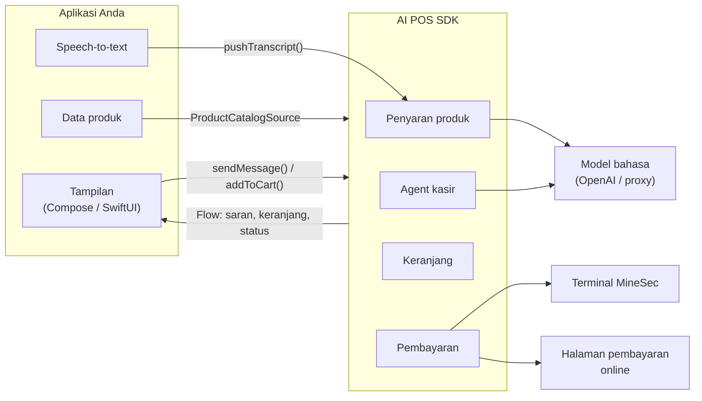

# Pengenalan

AI POS SDK adalah pustaka Kotlin Multiplatform yang menambahkan kemampuan kasir pintar ke
aplikasi point-of-sale milik Anda. SDK ini **tidak membawa tampilan apa pun** — seluruh
layar, tombol, dan desain tetap milik aplikasi Anda. SDK menyediakan logika, data, dan
alur transaksinya.

## Apa yang bisa dilakukan

| Kemampuan | Contoh | Halaman |
|---|---|---|
| **Penyaran produk** | Pelanggan berkata *"saya cari hp buat foto-foto, budget 15 juta"* → SDK menyarankan iPhone 15 dan Pixel 8 beserta alasannya | [Penyaran produk](https://dev-mobile-wknd.github.io/aipos-sdk-docs/id/features/advisor) |
| **Agent kasir** | Kasir mengetik *"cari MacBook Air, tambah 1, bayar"* → agent menjalankan semuanya | [Agent kasir](https://dev-mobile-wknd.github.io/aipos-sdk-docs/id/features/agent) |
| **Keranjang** | Tambah, ubah jumlah, hapus, dengan validasi stok | [Keranjang](https://dev-mobile-wknd.github.io/aipos-sdk-docs/id/features/cart) |
| **Pembayaran kartu** | Pelanggan menempelkan kartu ke ponsel Android | [Pembayaran kartu](https://dev-mobile-wknd.github.io/aipos-sdk-docs/id/features/card-payment) |
| **Pembayaran online** | Pelanggan membayar lewat VA, QRIS, atau kartu di halaman pembayaran | [Pembayaran online](https://dev-mobile-wknd.github.io/aipos-sdk-docs/id/features/online-payment) |

## Cara kerjanya

Tiga prinsip yang perlu dipahami sejak awal:

1. **Data produk milik Anda.** SDK tidak punya katalog sendiri. Anda menyerahkan daftar
   produk lewat [`ProductCatalogSource`](https://dev-mobile-wknd.github.io/aipos-sdk-docs/id/features/catalog), dan SDK hanya membacanya.
2. **Mikrofon milik Anda.** Untuk penyaran produk, aplikasi Anda yang merekam dan
   mengubah suara jadi teks, lalu menyetorkan teksnya ke SDK.
   Lihat [Speech-to-text](https://dev-mobile-wknd.github.io/aipos-sdk-docs/id/guides/speech-to-text).
3. **Semua state berupa stream.** Keranjang, saran, dan status pembayaran dipancarkan
   sebagai Kotlin `Flow`, sehingga layar Anda cukup mengamati dan menggambar ulang.

## Dukungan platform

| Fitur | Android | iOS |
|---|:---:|:---:|
| Penyaran produk | ✅ | ✅ |
| Agent kasir | ✅ | ✅ |
| Keranjang & riwayat transaksi | ✅ | ✅ |
| Pembayaran kartu contactless | ✅ | ❌ |
| Pembayaran online (WebView) | ✅ | ✅ |

:::info[Kenapa iOS belum bisa menerima kartu]
CoreNFC di iPhone hanya bisa membaca tag, bukan bertindak sebagai terminal EMV. Tap to Pay
on iPhone memerlukan framework `ProximityReader` beserta entitlement khusus dari Apple.
Di iOS, `processPayment()` langsung memancarkan `PaymentState.Failed` dengan penjelasan
tersebut. Gunakan [pembayaran online](https://dev-mobile-wknd.github.io/aipos-sdk-docs/id/features/online-payment) sebagai gantinya.
:::

## Persyaratan

| Kebutuhan | Versi |
|---|---|
| Android `minSdk` | 26 (Android 8.0) |
| Android `compileSdk` | 36 |
| JDK untuk build | 17 |
| Kotlin (proyek Kotlin Multiplatform) | 2.3.21 atau lebih baru |
| iOS | Target `iosArm64`, `iosSimulatorArm64`, `iosX64` |
| Kunci model bahasa | OpenAI API key atau endpoint proxy yang kompatibel OpenAI — hanya untuk fitur AI |
| Kredensial MineSec | Hanya untuk pembayaran kartu sungguhan |

## Langkah berikutnya

- [Memilih artifact](https://dev-mobile-wknd.github.io/aipos-sdk-docs/id/guide/choosing-artifacts) — tentukan modul yang Anda perlukan.
- [Instalasi](https://dev-mobile-wknd.github.io/aipos-sdk-docs/id/guide/installation) — tambahkan SDK ke proyek Gradle.
- [Mulai cepat](https://dev-mobile-wknd.github.io/aipos-sdk-docs/id/guide/quick-start) — transaksi pertama dalam sepuluh menit, tanpa perangkat keras.
