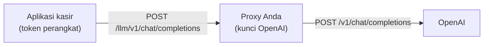

# Proxy LLM

Kunci API yang dibundel ke aplikasi bisa dibongkar dari APK atau IPA. Untuk produksi,
simpan kunci di server Anda dan biarkan aplikasi memanggil server itu.



## Konfigurasi di aplikasi

```kotlin
AIPosSDK.Builder()
    .llmProxyBaseUrl("https://api.tokoanda.com/llm")   // without /v1
    .llmApiKey(deviceToken)                             // optional: sent to the proxy, not to OpenAI
    // ...
```

Bila `llmProxyBaseUrl` diisi, SDK memanggil `{llmProxyBaseUrl}/v1/chat/completions`. Nilai
`llmApiKey` — bila ada — dikirim sebagai token `Authorization: Bearer` ke proxy, sehingga
proxy bisa mengenali dan mencabut perangkat tertentu.

## Syarat proxy

Proxy harus **kompatibel dengan OpenAI Chat Completions API**:

- Menerima `POST /v1/chat/completions` dengan badan permintaan format OpenAI.
- Mendukung pemanggilan *tools* (function calling) — dipakai agent kasir.
- Mengembalikan respons dalam format OpenAI.
- Melayani model yang diminta SDK: **GPT-5.4 mini** (`OpenAIModels.Chat.GPT5_4Mini`). Bila proxy
  memetakan ke model lain, pastikan model tersebut juga mendukung *tools*.

Pilihan yang sudah memenuhinya:

| Pilihan | Catatan |
|---|---|
| **LiteLLM** | Gateway siap pakai; mendukung kuota per kunci dan banyak penyedia |
| **Azure OpenAI** | Arahkan ke endpoint yang kompatibel OpenAI |
| **Backend sendiri** | Teruskan permintaan apa adanya ke OpenAI sambil menambahkan kunci |

## Contoh proxy minimal (Node.js)

```javascript
import express from 'express';

const app = express();
app.use(express.json({ limit: '2mb' }));

app.post('/llm/v1/chat/completions', async (req, res) => {
  const token = req.get('authorization')?.replace('Bearer ', '');
  if (!(await isDeviceAuthorized(token))) return res.status(401).json({ error: 'unauthorized' });

  const upstream = await fetch('https://api.openai.com/v1/chat/completions', {
    method: 'POST',
    headers: {
      'content-type': 'application/json',
      authorization: `Bearer ${process.env.OPENAI_API_KEY}`,
    },
    body: JSON.stringify(req.body),
  });

  res.status(upstream.status).type('application/json').send(await upstream.text());
});

app.listen(8080);
```

Tambahkan di proxy Anda: batas laju per perangkat, pencatatan pemakaian, dan daftar model
yang diizinkan.

## Kesalahan umum

| Gejala | Penyebab |
|---|---|
| 404 dari proxy | `llmProxyBaseUrl` diakhiri `/v1`, sehingga path menjadi `/v1/v1/chat/completions` |
| Saran kosong, `observeAdvisorError()` berisi pesan 401 | Proxy menolak token perangkat |
| Agent tidak pernah menjalankan aksi | Proxy atau model di baliknya tidak mendukung *tools* |
